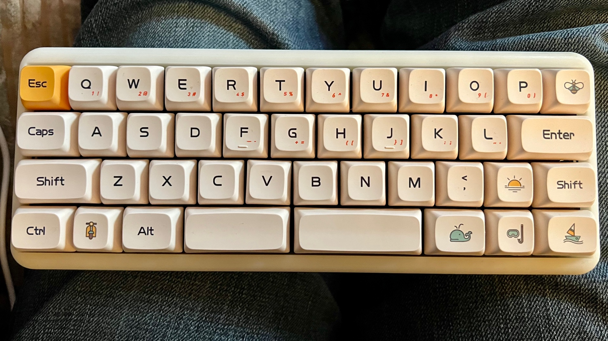
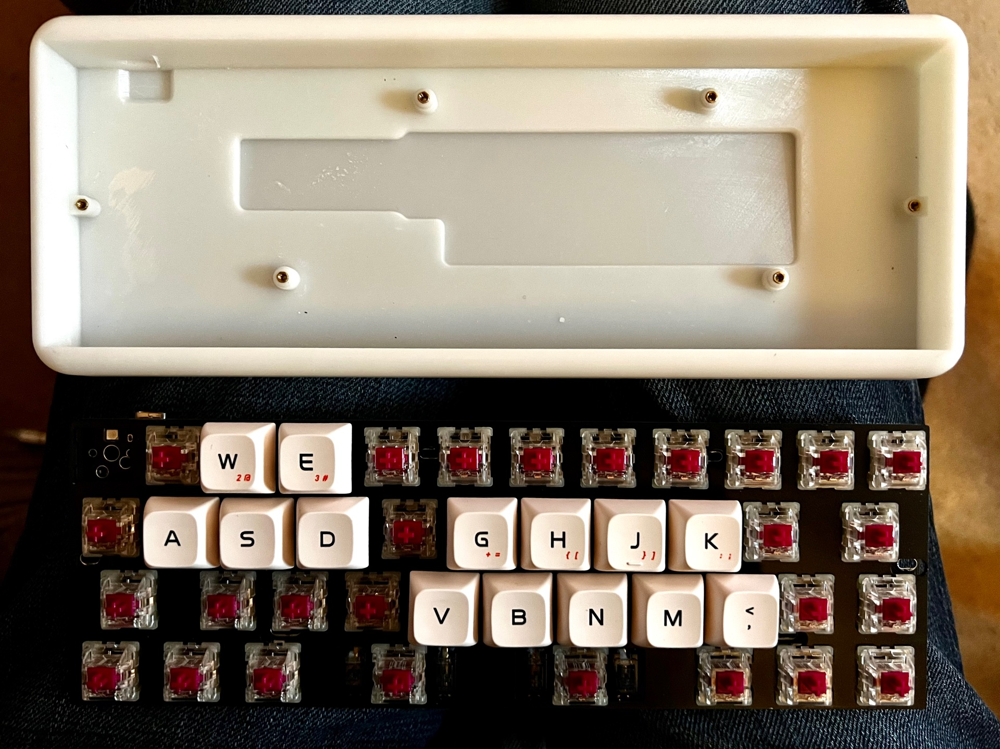
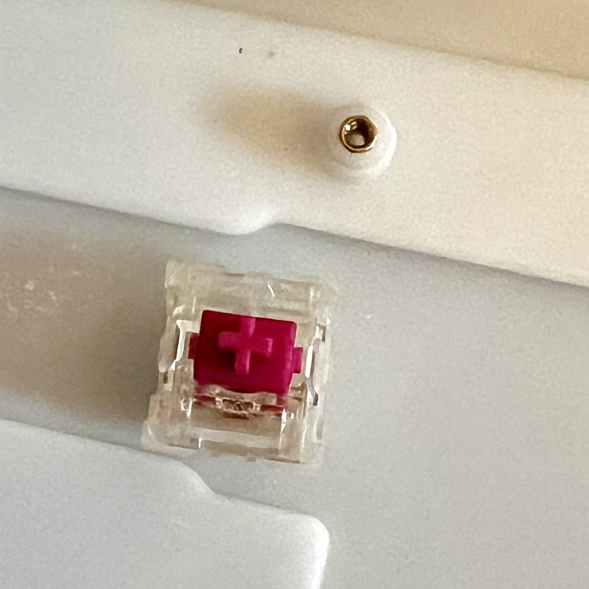
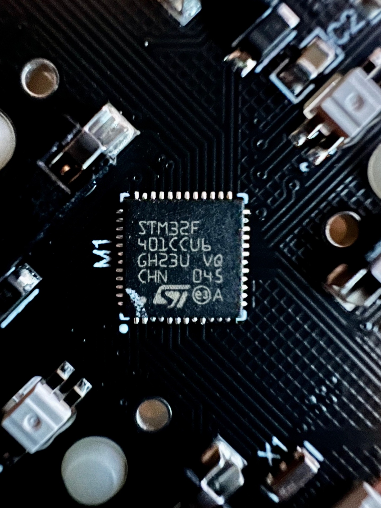
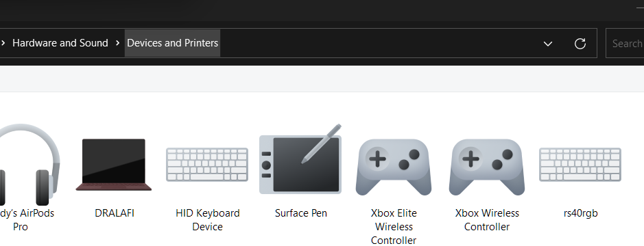

# RS40-RGB Keyboard information

## Retail

**From AliExpress**

- https://www.aliexpress.com/item/1005003748780689.html

> Programmable Mini Mechanical Keyboard Support VIA White Resin Case Type-c Hot Swappable PCB Kailh Hot Plug Base 40 Mini Keyboard

- Wine red linear Kailh switches (see image)
- Vendor supplied VIA layout file

### Disassembly images









### Investigation



Shows up in QMK Toolbox

```text
USB device connected (HidUsb): (Standard system devices) USB Input Device (AA96:AAAC:0001)
USB device connected (HidUsb): (Standard system devices) USB Input Device (AA96:AAAC:0001)
USB device connected (usbccgp): (Standard USB Host Controller) USB Composite Device (AA96:AAAC:0001)
USB device connected (HidUsb): (Standard system devices) USB Input Device (AA96:AAAC:0001)
```

dmesg on Ubuntu

```text
[ 1875.040201] usb 1-1: new full-speed USB device number 5 using xhci_hcd
[ 1880.283040] usb 1-1: New USB device found, idVendor=aa96, idProduct=aaac, bcdDevice= 0.01
[ 1880.283050] usb 1-1: New USB device strings: Mfr=1, Product=2, SerialNumber=0
[ 1880.283054] usb 1-1: Product: rs40rgb
[ 1880.283057] usb 1-1: Manufacturer: WJC
[ 1880.991648] usbcore: registered new interface driver usbhid
[ 1880.991654] usbhid: USB HID core driver
[ 1881.037047] input: WJC rs40rgb as /devices/pci0000:00/0000:00:14.0/usb1/1-1/1-1:1.0/0003:AA96:AAAC.0001/input/input17
[ 1881.096659] hid-generic 0003:AA96:AAAC.0001: input,hidraw0: USB HID v1.11 Keyboard [WJC rs40rgb] on usb-0000:00:14.0-1/input0
[ 1881.102990] hid-generic 0003:AA96:AAAC.0002: hiddev0,hidraw1: USB HID v1.11 Device [WJC rs40rgb] on usb-0000:00:14.0-1/input1
[ 1881.104569] input: WJC rs40rgb Mouse as /devices/pci0000:00/0000:00:14.0/usb1/1-1/1-1:1.2/0003:AA96:AAAC.0003/input/input18
[ 1881.162565] input: WJC rs40rgb System Control as /devices/pci0000:00/0000:00:14.0/usb1/1-1/1-1:1.2/0003:AA96:AAAC.0003/input/input19
[ 1881.163751] input: WJC rs40rgb Consumer Control as /devices/pci0000:00/0000:00:14.0/usb1/1-1/1-1:1.2/0003:AA96:AAAC.0003/input/input20
[ 1881.164472] input: WJC rs40rgb Keyboard as /devices/pci0000:00/0000:00:14.0/usb1/1-1/1-1:1.2/0003:AA96:AAAC.0003/input/input21
[ 1881.167061] hid-generic 0003:AA96:AAAC.0003: input,hidraw2: USB HID v1.11 Mouse [WJC rs40rgb] on usb-0000:00:14.0-1/input2
```

--> keyboard USB VID AA96 PID AAAC

STM32F401CCU6 chip

### Layout

42 keys
4 rows

*Configuration*
1 x 12
1.25, 9, 1.75
1.75, 9, 1.25
1.25, 1, 1.25,  2.25,  2.75, 1.25, 1, 1.25

## Software

**STM32 Arduino repo**
https://github.com/stm32duino/BoardManagerFiles/raw/main/package_stmicroelectronics_index.json

**QMK PR**
https://github.com/qmk/qmk_firmware/pull/12559
(but this uses Atmel chip?)

**VIA PR**
https://github.com/the-via/keyboards/pull/671

Linux (Ubuntu 22.04)

```text
$ lsusb
...
Bus 001 Device 008: ID aa96:aaac WJC rs40rgb
...
```

Get into programming mode: hold Esc when plugging in

```text
$ lsusb
...
Bus 001 Device 007: ID 0483:df11 STMicroelectronics STM Device in DFU Mode
...
...
$ sudo dmesg
...
[ 2517.683490] usb 1-1: new full-speed USB device number 7 using xhci_hcd
[ 2517.832671] usb 1-1: New USB device found, idVendor=0483, idProduct=df11, bcdDevice=22.00
[ 2517.832688] usb 1-1: New USB device strings: Mfr=1, Product=2, SerialNumber=3
[ 2517.832696] usb 1-1: Product: STM32  BOOTLOADER
[ 2517.832702] usb 1-1: Manufacturer: STMicroelectronics
[ 2517.832708] usb 1-1: SerialNumber: 306F359C3237
...
```

Now in DFU mode, dump the firmware (using STM DFuSE)

```shell
$ dfu-util -a 0 -s 0x08000000 -U newfile0.bin
...
$ dfu-util -a 1 -s 0x1FFFC000 -U newfile1.bin
...
$ dfu-util -a 2 -s 0x1FFF7800 -U newfile2.bin
...
$ dfu-util -a 3 -s 0xFFFF0000 -U newfile3.bin
...
```

Not detected in Vial
