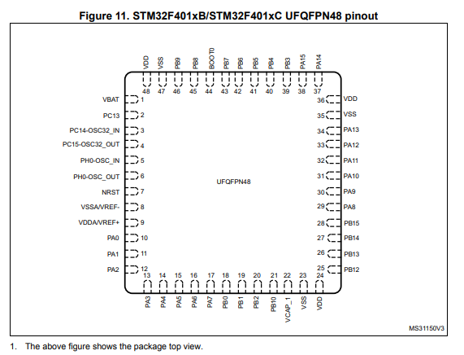
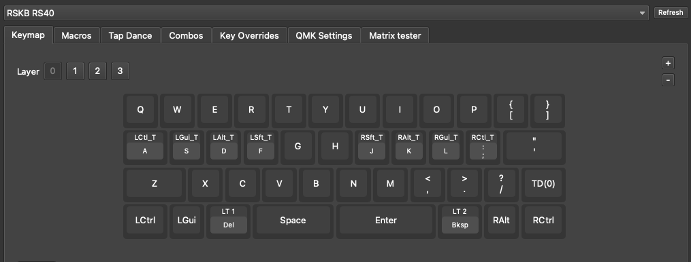

# RS40-RGB Keyboard Vial firmware

## Via firmware

The vendor supplied VIA firmware through two files. This repository contains these files in the vendor folder.
- VIA firmware (rs40_f401_via.bin)
- VIA layout file (rs40rgb401.json)

The VIA firmware requires you to sideload the layout file when you want to make changes. Furthermore this firmware does not support Tap Dance and Combos. Therefore i decided to creat a Vial firmware that has these features.

## Reverse engineer qmk keyboard

The keyboard matrix was reverse engineer from the PCB with a multi-meter. The image below shows all the pins on the STM32F401UU and which pins are used for the rows and columns.

| pin number  | pin name | matrix label |
|-------------|----------|--------------|
|  26         |  PB13    |   row01      |
|  31         |  PA10    |   row02      |
|  19         |  PB1     |   row03      |
|  21         |  PB10    |   row04      |
|-------------|----------|--------------|
|  25         |  PB12    |   col01      |
|  27         |  PB14    |   col02      |
|  28         |  PA15    |   col03      |
|  29         |  PA8     |   col04      |
|  30         |  PA9     |   col05      |
|   2         |  PC13    |   col06      |
|  46         |  PB9     |   col07      |
|  45         |  PB8     |   col08      |
|  41         |  PB5     |   col09      |
|  40         |  PB4     |   col10      |
|  39         |  PB3     |   col11      |
|  38         |  PB15    |   col12      |

The firmware was based on a branch by [WJC](https://github.com/wjc21wjc) mentioned in the notes <https://github.com/qmk/qmk_firmware/pull/12559> although this branch is now removed from the qmk repo. Luckily i stored it before that happened. 

Changes made
- changed mcu to stm32f401
- changed bootloader to stm32-dfu
- updated row and col pins
- remove audio support
- added the rskb folder to vial-qmk and compiled

## Compile firmware

To compile the firmware the following steps have to be taken.

- download [QMK vial](https://github.com/vial-kb/vial-qmk)
- copy the rskb folder from this repo into the keyboards folder of vial-qmk repo
- run 'make rskb/rs40:vial' to build the .bin file
- optionally run 'make rskb/rs40:vial:flash' to immediately flash it after compiling
- optionally just download the firmware in this folder: rskb_rs40_vial.bin

## Keyboard in Vial

After loading the firmware Vial should be able to recognize the firmware without having to load an json file. And you will be able to use tap dance and combos.

Sometimes Vial might ask you to unlock the keyboard. This can be done by pressing and holding the buttons it asks you to press.

## Turn the keyboard into dfu mode

If your current keymap does not have the RESET keycode configured you can reset the keyboard by shorting the two pins on the bottom of the pcb labeled "key1" while you plug in the keyboard. To make this easier you can also solder a switch on the footprint that is there.

## Todo

My RS40 does not have RGB leds. So i was not able to test RGB support. In the future i will solder on RGB leds and create an rs40rgb configuration as well.

## Tools

- [QMK vial](https://github.com/vial-kb/vial-qmk)
- [Vial](https://get.vial.today/)
